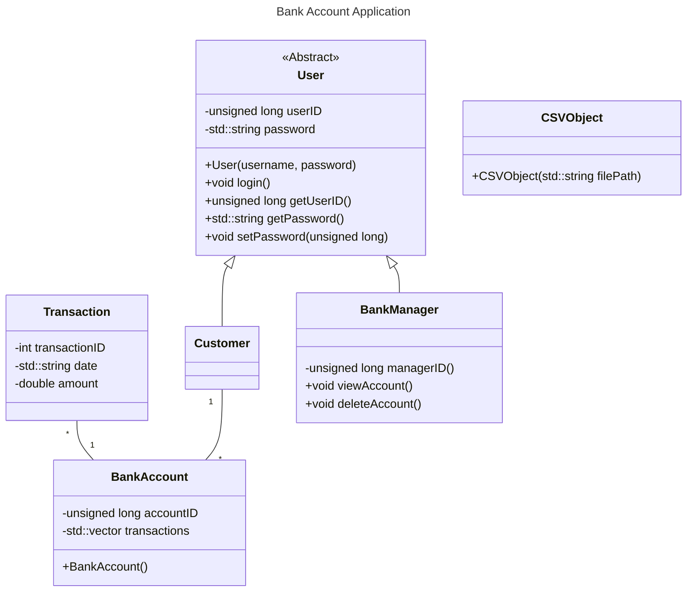

# UWGB COMP SCI 371 Group Project

In partial fulfilment of the graduation requirements for UWGB's COMP SCI 371 (Advanced Object-Oriented Design) course, this project is a simple banking application written in C++ by a team of students in the course.

## Running the Application

Since this banking application utilizes only the standard template library, only a C++ compiler/build system as well as the CMake tool is needed to compile and run this application. The directions for building the application are listed in the `CMakeLists.txt` file of the repository's root directory.

## UML Diagram

